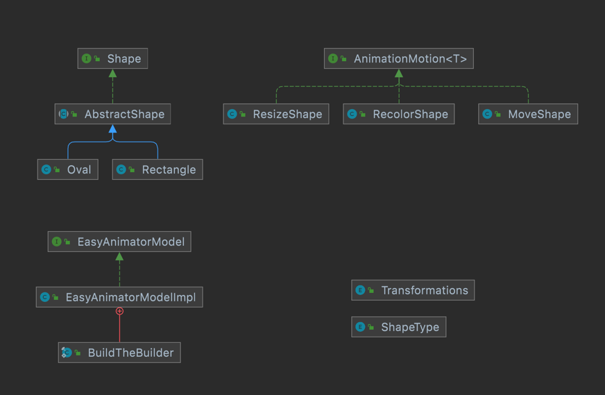

EasyAnimation
====================

## Overview

*****
The Easy Animator Application is built using the classic Model-View-Controller architecture. This
project could take user input to generate 2D shapes and animation, then to generate various types of
views for users. Users will be able to edit the animation at their wills in the aspect of position,
color and size of the color, and animation time, speed, etc.

## Model

****

* Interfaces
    * Shape
    * AnimationMotion
    * EasyAnimatorModel
    * AnimationBuilder
* Classes
    * Oval
    * Rectangle
    * MoveShape
    * RecolorShape
    * ResizeShape
    * AbstractShape
    * EasyAnimatorModelImpl
    * AnimationReader
* Enum
    * ShapeType
    * Transformations

**Shape**  
This interface defines all the methods any Shape class should implement, mainly consisting of
setters and getters.

**AnimationMotion**  
This interface defines all the methods any Motion class should implement, including executeChange(),
stringFrom() and some common getters.

**EasyAnimatorModel**
This interface defines all the methods our model class should implement. Methods should satisfy all
kinds of needs like adding or removing, and some getters.

**AnimationBuilder**  
This interface helps to define the builder, which will connect the input file with our model.

**AbstractShape** (implements **Shape**)
The class was created to reduce code duplication, because there are many variables and methods will
be used in Oval and Rectangle classes.

**Oval** (extends **AbstractShape**)  
This class represents the Oval shape, and it extends the class AbstractShape.

**Rectangle** (extends **AbstractShape**)  
This class represents the Rectangle shape, and it extends the class AbstractShape.

**MoveShape** (implements **AnimationMotion**)  
This class represents changes to the shape object, and it will move the object from an old position
to a new one.

**RecolorShape** (implements **AnimationMotion**)  
This class represents changes to the shape object, and it will change the original color to a new
one.

**ResizeShape** (implements **AnimationMotion**)  
This class represents changes to the shape object, and it will change the size of the object.

**EasyAnimatorModelImpl** (implements **EasyAnimatorModel**)  
This class represents our model. The model will store shapes, their attributes and their motion.
Besides, this class also have some getters to present the animation based on the timeline.

**AnimationReader**  
This class will help us to read the input file.

**ShapeType**  
This enumerates all the shape type the project supports.

**Transformations**  
This enumerates all the change type the project supports.

## View

***

* Interfaces
    * View
* Classes
    * SvgView
    * TextView
    * VisualView
    * Panel
    * Frame
    * ViewSelector
* Enum
    * ViewType

**View**
This interface defines all the methods any View class should implement. It mainly has some getters
to return model data to users in specific ways.

**TextView** (implements **View**)  
This class represents the TEXT View. This view will return users animations in string form.

**SvgView** (implements **View**)  
This class represents the SVG View. This view will return users animations in SVG file, so they can
view the file in some browsers.

**VisualView** (implements **View**)  
This class represents the VISUAL View. This view will return users animations in a new window.

**Panel**  (implements **JPanel**)  
This class represents Panels we are going to use in Frames.

**Frame**  (implements **JFrame**)
This class represents Frames we are going to use in Visual views.

**ViewType**  
This enumerates what kinds of views the application supports.

## Controller

***
Controller acts as a bridge. It gets the data from the user (mainly through the Main method) and
determines which type of view to return according to the input.

